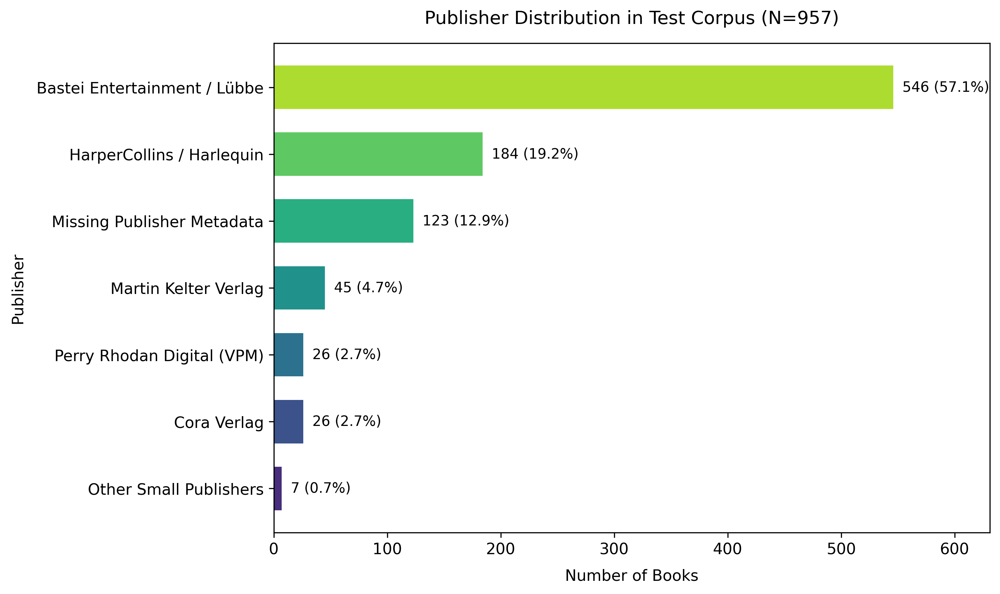
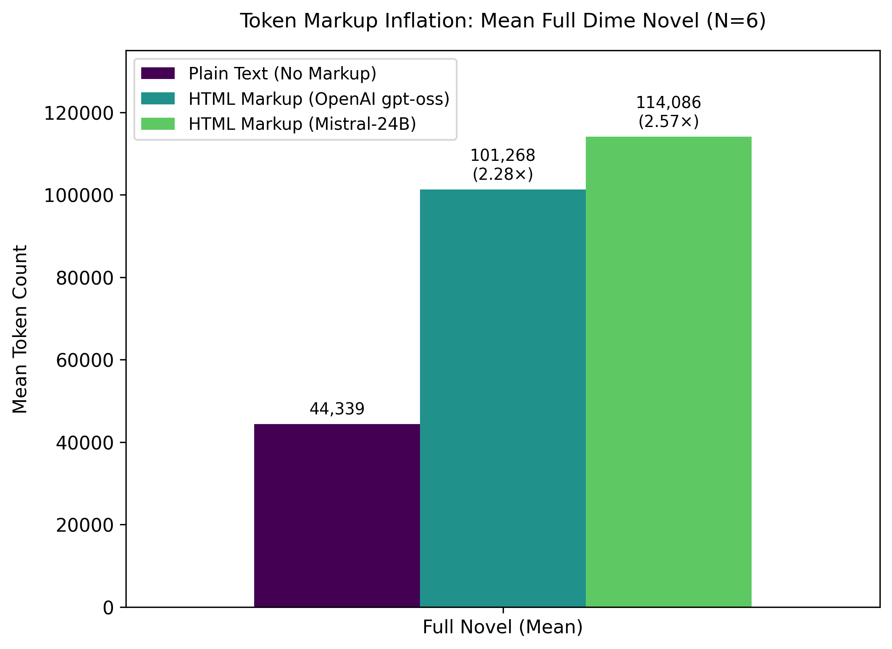

## Corpus Description

Due to German copyright law of commercial e-books, full-text datasets, gold standards or intermediate text formats cannot be published or distributed. To provide an insight into the characteristics of the corpus, this page provides an overview of the data used in this project including a structural analysis of publisher markup as well as a tag frequency analysis.

## Corpus Overview

German dime novels are published across a wide variety of genres as both standalone weekly issues and multi-issue omnibus editions (*Sammelbände*) in print as well as in EPUB format.

- **Local test corpus:** To design the taxonomy, test extraction heuristics, annotate the gold-standard and evaluate the LLM classification of text types we used a representative test corpus of 957 EPUB files of German dime novels (standalone and omnibus editions) acquired by the Chair of Computational Philology at the University of Würzburg. This collection covers diverse serial popular genres, including Westerns (*Lassiter*, *G.F. Unger*), horror (*John Sinclair*, *Dorian Hunter*, *Maddrax*), romance (*Baccara*, *Julia Extra*) and science-fiction (*Perry Rhodan*).

- **The German National Library Collection (DNB corpus):** The target production dataset consists of 35,087 EPUB files of dime novels. Using our Python tool `epub_unpack` we extracted 35,068 books into the intermediate structured JSON format, making them ready for further processing.

{width="70%"}

## Structural Analysis

Analysing the XML and HTML files inside the test data set revealed a lack of standardised semantic markup systems within and across publishing houses.

Publishers rarely use semantic HTML tags to mark document hierarchies. Instead, they rely on visual simulation: encoding headings, body text, indents and separators through generic paragraph `
` and highlight `<hi>` tags combined with inline CSS or custom rend attributes.

Differences between publishers (examples):

- **Bastei Entertainment:** Bastei Entertainment uses a consistent but non-semantic styling system. Headings and scene transitions are often marked using specific paragraph rendering classes (e.g., `
` to denote paragraph spacing or `
` for centered paragraph blocks.
- **Cora and HarperCollins:** These publishers use highly inconsistent, divergent visual encodings. Translating these files requires mapping a long tail of volatile CSS classes and inline style definitions.

Differences of encoding conventions (examples):

- Bold (`<b>`) and italic (`<i>`) tags are largely replaced by `<hi rend="italic">` (158k occurrences) or proprietary CSS wrapper classes like `<hi rend="class-0">`.
- Scene breaks and sub-chapter transitions are encoded as decorative text paragraphs, such as `
` (containing “\*\*\*”) or `
`.
- In more than 12,000 instances, image nodes (`<graphic>`) are embedded as direct child elements inside `
` containers rather than as standalone block items.

These open-ended markup variations show that a rule-based approach to transform these files into a standardised TEI format is neither practical nor constructive.

## Tag-Frequency Analysis

To estimate the API cost for text type classification, we conducted a systematic token frequency analysis. We processed 110 chapters extracted from 6 representative novels across different publishers, comparing the raw plain text token count against the token count of the same text containing all HTML/CSS tags using both OpenAI (gpt-oss) and Mistral (Mistral-24B) tokenizers.

The analysis shows that EPUB HTML tags and verbose CSS declarations more than double the token consumption compared to plain text, inflating the token count of text segments by a factor of 2.26× to 2.53×.

{width="70%"}

The longest individual chapters in the corpus contain about 25,600 markup tokens. Standard context windows (32k/128k) accommodate these segments without requiring sub-chunking.

## Project Considerations

To stay within LLM context windows without losing semantic context, we decided against arbitrary token-length splitting. Instead, we opted for a hybrid approach [pipeline](pipeline.qmd), in which the smallest units of text (individual chapters and paratexts) are extracted and passed as input to a model alongside a detailed prompt for text type classification.