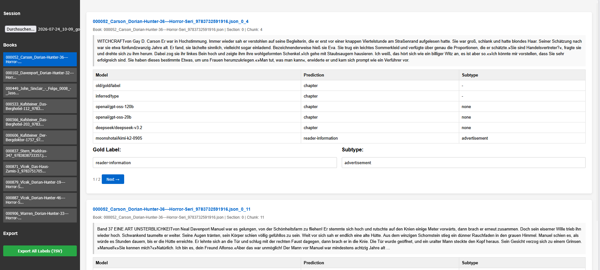
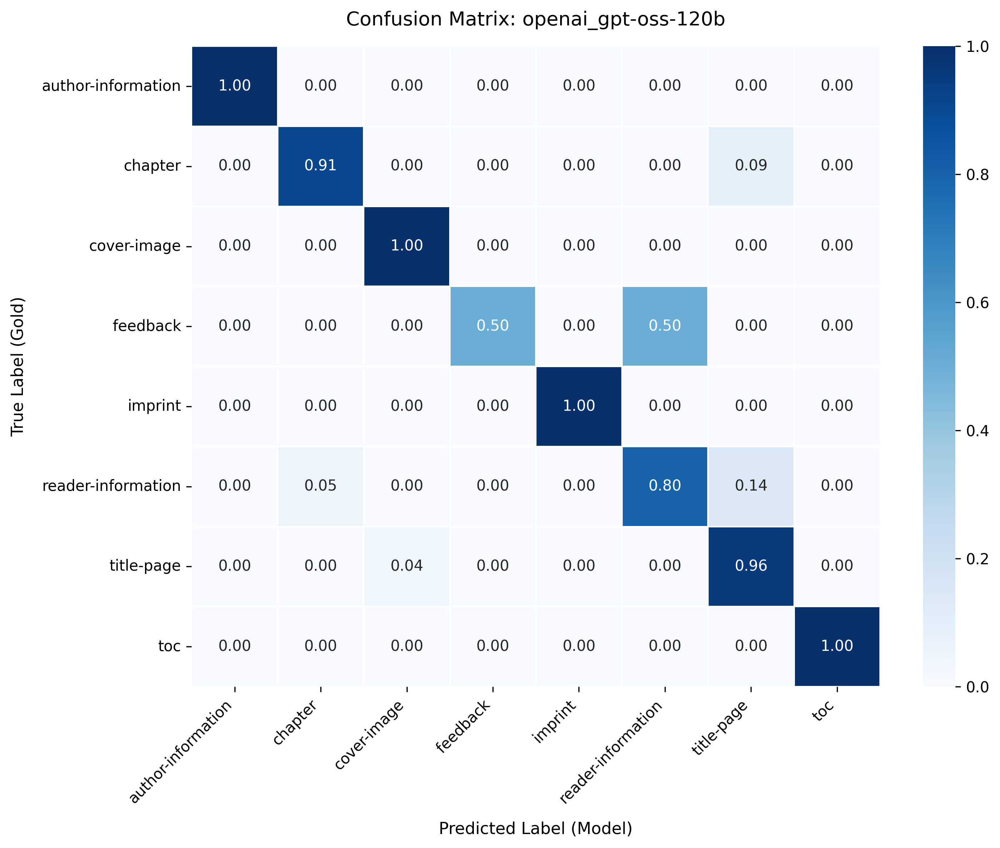
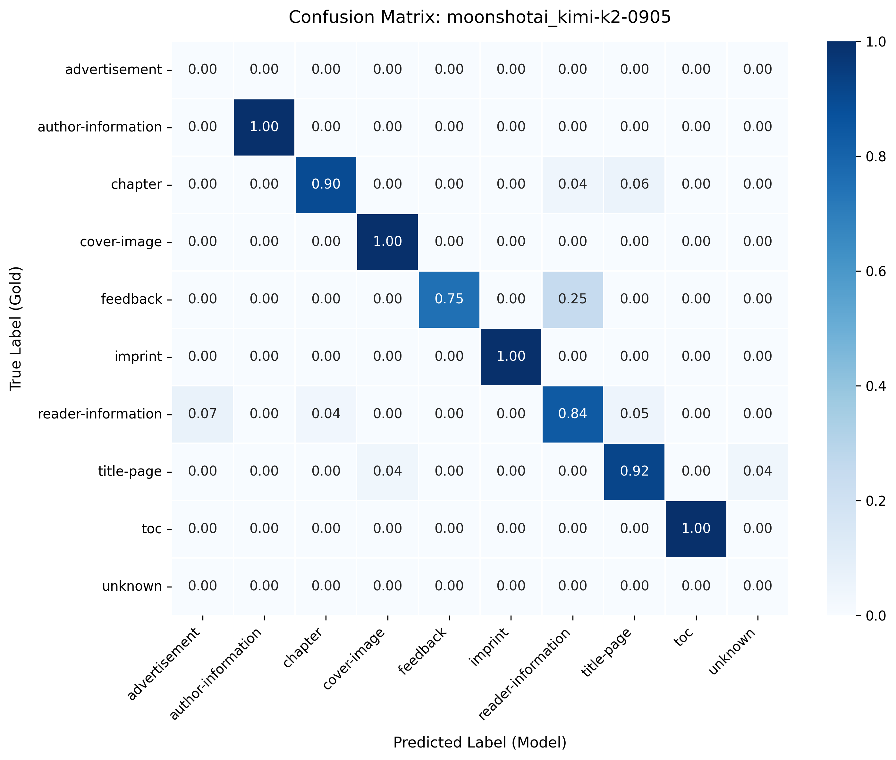
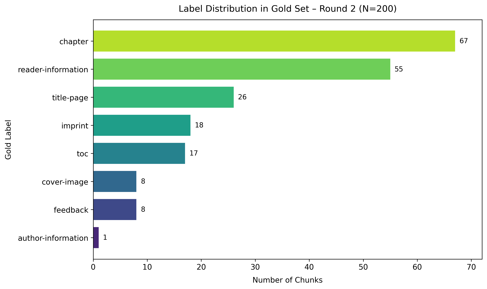
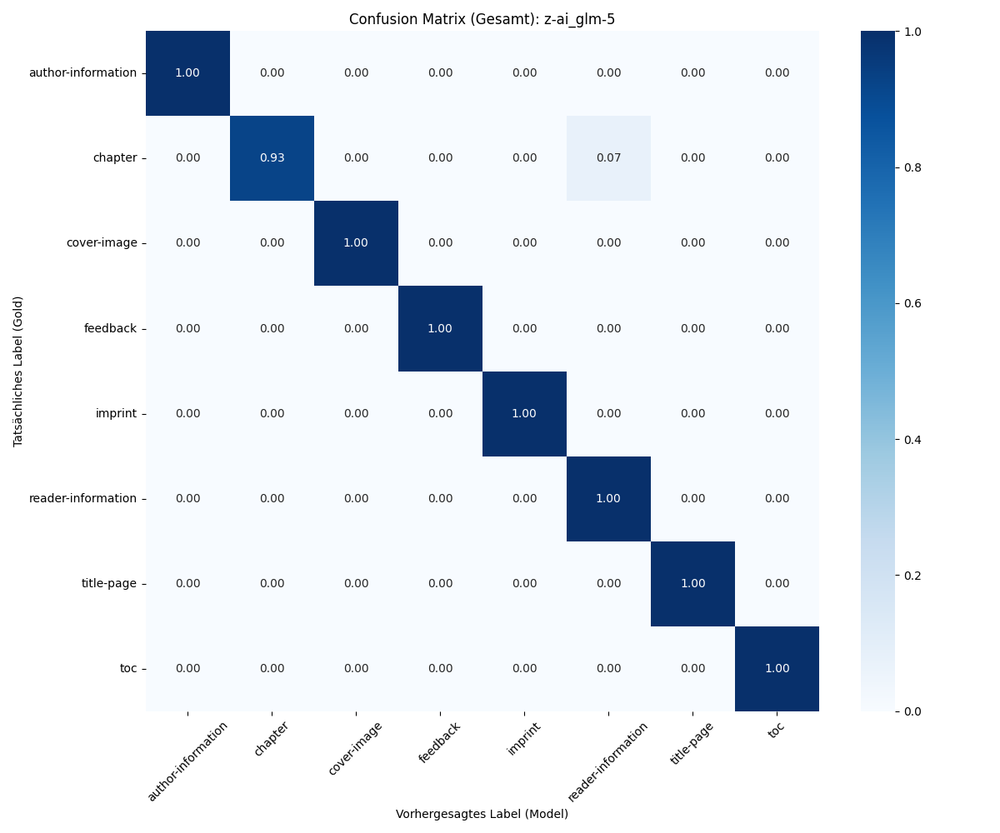

## Evaluation and Benchmarking Results

To identify the best model for the classification task and to determine the quality of the classification we created a gold dataset and conducted evaluations across LLMs of various sizes and taxonomic configurations. Since our corpus is protected by copyright we avoid commercial APIs and deploy open-weight models for inference.

## The Gold Standard Test Set

The classification of text types in dime novels poses an inherent class imbalance problem. Their narrative body accounts for most of all content segments. A random test sample would result in a dataset dominated by story chapters.

To counter this issue, we created a stratified sample. From 25 novels (1071 segments) of the [test corpus](dataset.qmd), which include different series and publishers, all non-chapter chunks were taken (134 in total). To reach 200 text chunks the remaining 67 segments were filled with randomly taken chapters from the same pool of novels.

{width="70%"}

## Annotation Workflow

To establish a verified baseline for classification evaluation and prompt refinement, we deployed a custom interactive HTML annotation tool. Rather than requiring annotators to interact with raw JSON files, this custom interface displays the original HTML chunk alongside the results of an initial automated pre-classification pass, allowing annotators to visually compare suggested labels. Annotators performed multi-pass manual labelling across the gold dataset. This dataset formed the ground truth used to benchmark all downstream LLM evaluations.

{width="70%"}

## Evaluation: Round 1

In the first evaluation phase, we tested five small open-weight models (≤120B parameters). The models were prompted to classify each segment of the gold dataset into an 11-class taxonomy shown in the distribution table above.

This setup presented a severe challenge because several paratextual classes shared highly overlapping semantic and stylistic boundaries (such as *reading samples* vs. *narrative chapters*, or *advertisements* vs. *series introductions*).

{width="70%"}

{width="70%"}

While moonshotai_kimi-k2 achieved the highest accuracy (90.0%), its Macro F1-score was significantly lower (0.744). This discrepancy indicates that while the model performs well on high-frequency categories like `chapter` (89.5% recall) and `reader-information` (85.5% recall), it degraded significantly on low-frequency paratexts, decreasing the unweighted macro average.

## Evaluation: Round 2

To resolve these boundary conflicts, we restructured the vocabulary into a two-tier [taxonomy](guidelines.qmd#label-taxonomy) of primary and secondary labels and restricted the LLM evaluation to the primary labels. Additionally, we benchmarked state-of-the-art open-weight models.

{width="70%"}

The table below displays the classification results of the second evaluation run on the gold dataset.

| **Model** | **Type** | **Accuracy** | **Macro Precision** | **Macro Recall** | **Macro F1** | **Weighted F1** |
|-----------|-----------|-----------|-----------|-----------|-----------|-----------|
| **z-ai_glm-5** | LLM | **0.975** | **0.990** | **0.991** | **0.989** | **0.975** |
| **qwen_qwen3.5-397b-a17b** | LLM | **0.975** | **0.990** | **0.991** | **0.989** | **0.975** |
| **openai_gpt-oss-120b** | LLM | 0.980 | 0.932 | 0.991 | 0.951 | 0.981 |
| **mistralai_mistral-large-2512** | LLM | 0.955 | 0.873 | 0.869 | 0.870 | 0.957 |
| **openai_gpt-oss-20b** | LLM | 0.940 | 0.904 | 0.971 | 0.926 | 0.940 |
| **moonshotai_kimi-k2-0905** | LLM | 0.945 | 0.834 | 0.857 | 0.841 | 0.948 |
| **meta-llama_llama-3.3-70b** | LLM | 0.900 | 0.920 | 0.864 | 0.859 | 0.892 |
| **deepseek_deepseek-v3.2-spec** | LLM | 0.965 | 0.850 | 0.866 | 0.856 | 0.970 |
| **inferred_type (rule-based baseline)** | Rule-based | 0.725 | 0.762 | 0.709 | 0.729 | 0.776 |
| **deepseek_deepseek-v3.2** | LLM | 0.830 | 0.736 | 0.772 | 0.722 | 0.830 |

{width="70%"}

GLM-5 and Qwen3.5-397B achieved a primary classification accuracy of 97.5% and a Macro F1-score of 0.989.

The gpt-oss-120b model climbed from 89.5% in the first evaluation pass to 98.0% (with the Macro F1-score rising from 0.813 to 0.951).

The rule-based baseline (inferred_type) generated through the `epub_unpack` tool achieved only a 0.729 Macro F1 score.

## Discussion

The highly favourable results achieved through LLM-based classification, particularly when contrasted with rule-based techniques, demonstrate that these traditional systems struggle to effectively manage the extensive variability in EPUB construction. Nevertheless, the good performance is partially attributable to methodological simplifications. Specifically, pragmatic constraints necessitated the use of only the broader, upper levels of the controlled vocabulary instead of its complete framework. Further investigation is required to validate these findings against the full vocabulary. An examination of the existing misclassifications offers a pathway for future optimization. The classification errors depicted in the confusion matrix for the top performing model GLM-5 stem from a 7% misclassification of `chapter` segments as `reader-information`. Interestingly, this pattern is asymmetric. This occurs because stylistic narrative prose is used in chapters as well as in previews or reading samples, which are grouped under the `reader-information` label. Human annotators and LLMs alike require positional and structural context within the document to reliably differentiate these cases. Incorporating positional context like sequence order or file placement is an evident possibility to improve classification performance in the future. 