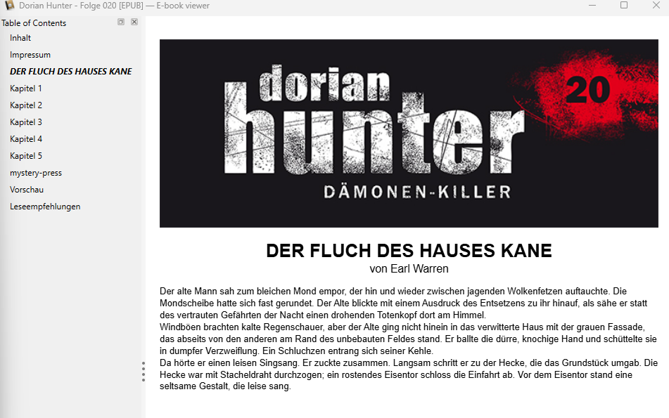

## Taxonomy and Annotation Guidelines

To enable scalable computational analysis of dime novels it is useful to semantically categorise their constituent text types. This page gives an overview of the controlled vocabulary created for text unit classification and describes the edge cases we found during its development.

The classification of text segments in commercial dime novels sits on a spectrum between two strategic extremes:

- **Binary Approach:** Dividing the core narrative from the non-narrative paratextual elements can be profitable since the main text is usually the target of analysis. While computationally simple, this method discards the range of paratext needed for diverse research interests.

- **Multi-Class Approach:** Categorising all fine-grained text types causes models and human annotators alike to fail on ambiguous boundaries where stylistic narrative prose is used in chapters as well as in paratexts like previews or reading samples

For pragmatic research interests we implemented a middle ground along this spectrum. In this two-tier hierarchy, the primary level isolates the main narrative core as well as categories that are of interest in our project, while a mandatory secondary level called `reader-information` groups ambiguous paratexts that are not essential to our project needs as subtypes.

## Label Taxonomy

### Main Labels

| Label | Meaning |
|-----------------|-------------------------------------------------------|
| `chapter` | A part of the narrative main text which is part of the story world (diegesis). It may contain: prologue, chapter. It may contain a header. |
| `title-page` | The bibliographical title page. The first page of issues that are collected in an omnibus. Contains the story title and optionally the author's name; may contain an image. No other text is allowed. |
| `cover-image` | The cover image of a novel. Does not contain text. |
| `imprint` | The publisher imprint containing legal information about the publisher and copyright. |
| `toc` | The table of contents. |
| `author-information` | Biographical information about the author. |
| `feedback` | Contains letters to the editor (Leserkontaktseite) or prompts for the reader to leave a review or rating. |
| `reader-information` | Meta-text and additional information for readers that is not part of the story world (diegesis) of this novel. **This label requires a subtype.** |
| `unknown` | No segment fits the above categories. |

### Subtypes

When a segment is assigned the `reader-information` label, one of the following subtypes must be specified:

| Subtype | Meaning |
|-----------------|-------------------------------------------------------|
| `meta-information` | Meta information about the fictional world. It might contain: Series summaries, historical info, recaps, FAQs. |
| `preview` | Preview of the next installment or reading samples. |
| `advertisement` | Short promotional content for other books/products. |
| `framing` | Positioned before the main plot (chapters). It might contain exposition/setup text for the main story (setting, characters, initial situation). |
| `editorial` | Might contain forewords, afterwords, acknowledgments by the author/editor. |
| `dedication` | A personal dedication. |
| `castlist` | A character list/cast. |
| `other` | No segment fits the above categories. |

## Edge Cases

Testing the vocabulary with human annotators and LLMs revealed the following ambiguities regarding differentiation of labels:

- **Ambiguity in narrative prose:** Reading samples and framing present identical linguistic, syntactical, and stylistic features to regular novel chapters. Without positional or contextual cues, both human annotators and LLMs frequently misclassified them as chapters.

- **Overlap between Advertisement vs. meta-information:** Promotional announcements and series plot summaries often overlap making it challenging to distinguish between advertisement and meta-information challenging.

- **Framing vs. beginning of the story:** In some instances, the framing of the novel includes the beginning main narrative. To protect the narrative from paratexual segments, we adopt a conservative annotation policy by categorising the entire segment as `framing`. This decision prioritises precision over recall, while accepting possible minor loss of the opening narrative sentences to ensure that no noise is introduced into the main narrative to enable clean downstream computational analysis of the main text.

{width="70%"}

Restructuring the taxonomy into the two-tier system eliminated boundary confusion, increasing classification performance on GPT-OSS-120b from 89.5% to 98.0% accuracy (Macro F1: 0.813 → 0.951).