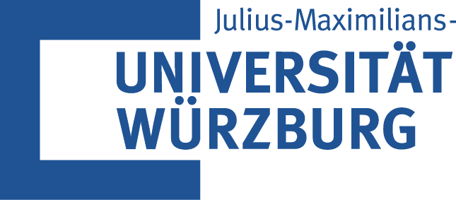
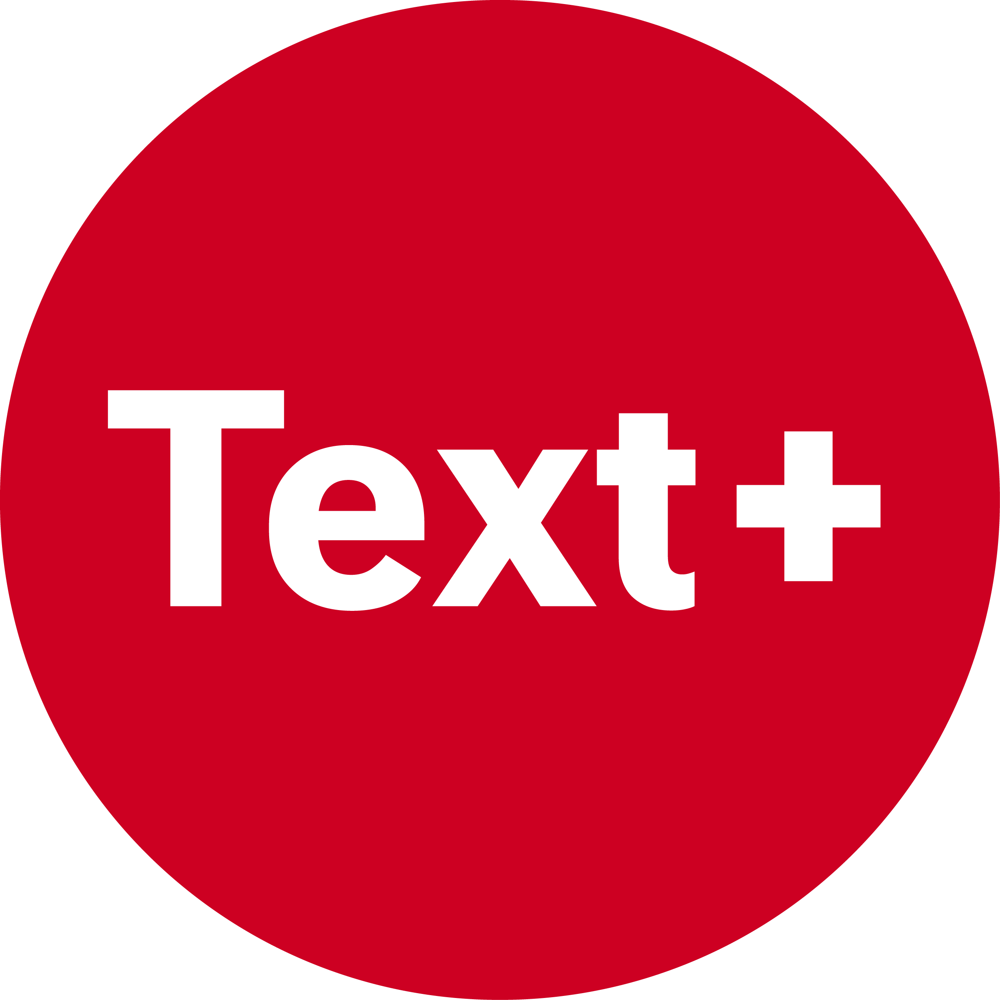

---
---

:::::::: {.columns .index-page}
:::: {.column width="20%"}
::: {.index-brand-rail}
[{width="80%"}](https://www.uni-wuerzburg.de)

[{width="50%"}](https://www.text-plus.org)

::: {.repository-links}
<a class="repository-link" href="https://github.com/cophi-wue/dimeclass" aria-label="dimeclass GitHub repository" title="dimeclass GitHub repository"><i class="bi bi-github" aria-hidden="true"></i>dimeclass</a>

<a class="repository-link" href="https://github.com/cophi-wue/epub_unpack" aria-label="epub_unpack GitHub repository" title="epub_unpack GitHub repository"><i class="bi bi-github" aria-hidden="true"></i>epub_unpack</a>
:::
:::
::::

:::: {.column .index-main-column width="55%"}
## Semantic Upconversion of German Dime Novels
Welcome to the documentation portal for the project "Erschließung und Strukturanalyse der Heftromane der Deutschen Nationalbibliothek" (Semantic Upconversion andStructural Analysis of German Dime Novels of the German National Library).

**Context and Scope**

This project was developed at the [Chair of Computational Philology](https://www.germanistik.uni-wuerzburg.de/computerphilologie/) at the University of Würzburg in cooperation with the National Research Data Infrastructure (NFDI) consortium [Text+](https://text-plus.org/), spanning from 01.08.2022 to 30.09.2026.
As part of the initiative “Erschließung und Strukturanalyse der Heftromane der Deutschen Nationalbibliothek”, the project aims at the semantic upconversion of German dime novels. This includes the transformation of commercial EPUB files into standardised and structurally enriched full-text corpora and derived formats (*Abgeleitete Textformate*, ATF) to enable large-scale text mining and computational literary analysis. The data basis for this project are roughly 35,000 EPUBs of German dime novels from the German National Library (DNB).

::: callout-note
## What is Text+?

Text+ is a consortium within the German National Research Data Infrastructure (NFDI – *Nationale Forschungsdateninfrastruktur*), funded by the DFG (German Research Foundation). It is dedicated to making text- and language-based research data permanently available for the humanities.
:::

**Core Problem**

Although commercial EPUBs are born-digital objects with machine-readable text, their internal markup follows no standardised conventions and is typically presentation-oriented rather than semantic. This means that page layouts are simulated via inline CSS and custom attributes (e.g., using generic `
` tags for headings). Moreover, the core narrative chapters are interleaved with various text types like front matter, advertisements and reading samples which makes it difficult to single out specific text types to study. Consequently, sematic upconversion is necessary to build a research corpus from such highly heterogeneous publisher formats.

**Project Objectives**

- Intermediate representation: Extracting raw EPUB markup into structured, uniform JSON work units for further processing.
- Semantic classification: Identifying narrative main text and paratextual components using open-weight Large Language Models (LLMs) according to a controlled taxonomy.
- TEI-XML upconversion: Transforming classified text units into TEI-XML.

**Key Achievements**

- [Controlled taxonomy of text types in dime novels](guidelines.qmd): Classification of narrative and paratextual components.
- [Gold standard dataset](dataset.qmd): Creation of a manually annotated gold standard dataset of 200 text units and corresponding text types.
- [Classification evaluation](evaluation.qmd): Open-weight models (GLM-5, Qwen3.5-397B) achieved a 0.989 Macro F1 score (97.5% accuracy) on the gold standard.
- [JSON extraction at scale](pipeline.qmd): Extracted 35,068 DNB EPUBs into structured JSON.
- [Modular pipeline](pipeline.qmd#stage-1-from-heterogeneous-epubs-to-normalized-json): Separation between JSON extraction, heuristic text unit segmentation and LLM labelling.
::::

:::: {.column width="25%"}
::: {.index-team-list}
**Project team**

- [Aidan Belisle](team.qmd#aidan-belisle)
- [**Fotis Jannidis**](team.qmd#fotis-jannidis)
- [Thora Hagen](team.qmd#thora-hagen)
- [Lennart Keller](team.qmd#lennart-keller)
- [Leonard Konle](team.qmd#leonard-konle)
- [Lilli Moutschka](team.qmd#lilli-moutschka)
- [Marina Spielberg](team.qmd#marina-spielberg)
:::
::::
::::::::