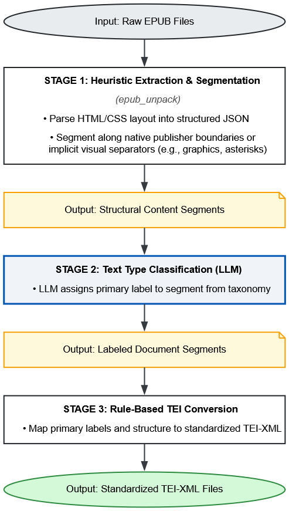
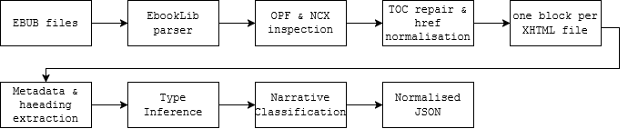
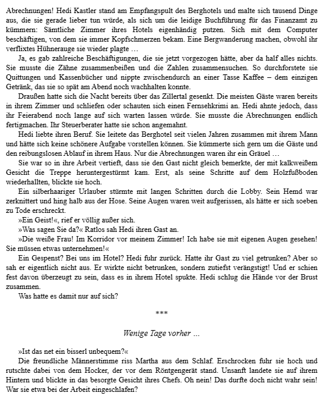
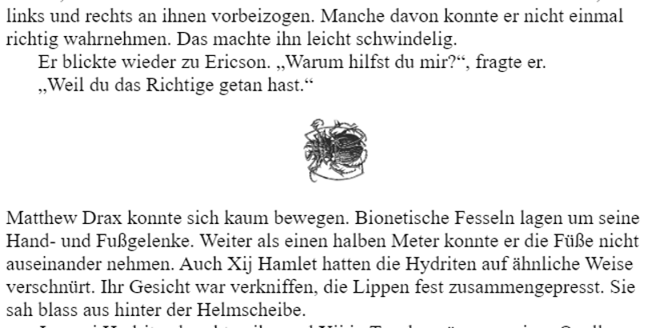

## Upconversion Workflow

This page documents the upconversion workflow which is made up of three steps.

{width="50%"}

**Stage 1: Preprocessing: Heuristic Extraction & Segmentation**

Stage one transforms the heterogenous EPUB files into a structured JSON format with the tool `epub_unpack` and heuristically chunks the text into content units. The tool was executed on the Dresden HPC infrastructure transforming 35,068 DNB EPUBS into JSON. While this confirmed the technical stability of the extraction pipeline, systematic evaluation of the semantic consistency and structural validity of the resulting JSON files remains an ongoing task.

::: callout-note
## Why developing an EPUB extraction tool from scratch?
There a number of TEI to EPUB conversion tools available, but we could not find a suitable open-source tool for the reverse direction (EPUB to TEI).
An initial idea was to check if we could reuse parts of the XSLT conversion structure used by the IDS in their [Epub to KorAP (via TEI I5) conversion project](https://github.com/KorAP/deliko) (see the article ["National Library as Corpus: Introducing DeLiKo\@DNB – a Large Synchronous German Fiction Corpus"](https://zenodo.org/records/14943116)). Upon closer inspection of their TEI conversion logic we decided that their approach does not fit the needs of our data structure. Since their TEI I5 schema is build around specific needs for linguistic data it would differ much from our dime novel data. Furthermore, the conversion uses Saxon EE which would lead to unwanted dependencies. So we decided to continue developing our own EPUB to JSON converter, which serves as a middle processing step to the final TEI conversion.
:::

**Stage 2: Semantic LLM Classification**

Stage two uses a Large Language Model (LLM) to assign these segments to text types from a controlled [taxonomy](guidelines.qmd#label-taxonomy).

**Stage 3: Post-processing: TEI Transformation & Serialisation (Outlook)**

Stage three executes a rule-based conversion into TEI. This step is planned. Ultimately, the goal is to apply this complete pipeline to all relevant dime novels in the German National Library (DNB) comprising over 35,000 EPUBs, which will enable subsequent large-scale computational analysis of both the narrative text and its paratextual surroundings.

## Stage 1: From Heterogeneous EPUBs to Normalized JSON

`epub_unpack` converts EPUB files from different publishers into a common, machine-readable JSON structure. It is designed for both local computer use and large-scale processing on Slurm-based HPC infrastructure.

The tool can:

- process a single EPUB or recursively scan directories
- skip already processed books for resumable workflows
- create per-book output files, processing and error reports

### How normalisation works

<br>

{fig-align="left" width="86%"}

For each EPUB, the tool:

- reads package metadata from the OPF file;

- compares the OPF spine with the NCX table of contents;

- inserts missing spine documents into the navigation structure;

- resolves links using original, fragment-free and decoded href variants;

- parses HTML with tolerant parsers;

- extracts comparable metadata such as titles and headings;

- removes duplicate references to the same document;

- stores all books using the same JSON schema.

This creates a consistent output format even when publishers differ in their EPUB packaging. The process is not lossless: malformed files, missing package documents or unresolvable links may still result in omitted or imperfectly interpreted content.

### JSON Output

A simplified output has this structure:

<details>

<summary>JSON Output</summary>

``` json
{
  "title": "Book title",
  "source": "path/to/book.epub",
  "epub_metadata": {
    "creator": "Author",
    "publisher": "Publisher",
    "date": "2016-01-01",
    "identifier": "978..."
  },
  "processing_log": {
    "toc_repair": false,
    "contain_subsections": true,
    "is_collection": false
  },
  "content": [
    {
      "type": "EpubHtml",
      "href": "chapter01.xhtml#start",
      "href_clean": "chapter01.xhtml",
      "found_via_href_clean": true,
      "title": "Chapter 1",
      "html_title": "Chapter 1",
      "body_titles": ["Chapter 1"],
      "inferred-type": "chapter",
      "text": "...",
      "is_narrative": true
    }
  ]
}
```

</details>

The `content` array follows the EPUB’s table-of-contents hierarchy.

Important fields include:

| Field | Meaning |
|------------------------------------|------------------------------------|
| `epub_metadata` | Metadata read from the EPUB’s OPF package document |
| `toc_repair` | Whether missing spine documents had to be added to the TOC |
| `contain_subsections` | Whether the TOC contains structural sections |
| `href` | Original navigation link |
| `href_clean` | Link with any fragment identifier removed |
| `title` | Title supplied by the EPUB navigation |
| `html_title` | Content of the HTML `<title>` element |
| `body_titles` | Text from `<h1>` to `<h5>` headings |
| `inferred-type` | Rule-based semantic label such as chapter, cover, or novel |
| `is_narrative` | BoW Classifier prediction for whether the block contains narrative text |

### Text Classification

The tool applies two complementary classification methods.

First, a rule-based system assigns `inferred-type` using:

- the navigation title;

- the filename;

- numbering patterns;

- selected words such as “Kapitel”, “Prolog”, “Impressum”, or “Cover”;

- the content ending with indicators such as “Ende”.

Second, a trained Bag of Words text classifier assigns `is_narrative`. This distinguishes narrative passages from material such as title pages, tables of contents, advertisements, front matter, and metadata pages.

### Smallest Content Unit

The smallest text-bearing unit is one complete XHTML or HTML file contained in the EPUB. The tool does not normally split a file into individual paragraphs, scenes, or sentences. The unit size is therefore determined by the publisher’s EPUB packaging:

- one file may contain one chapter

- one file may contain an entire novel

- one file may contain only an imprint or title page

The tool normalises and classifies the texts, but it does not create new textual boundaries.

### Text chunking

To stay within LLM context windows without losing semantic context, we avoided arbitrary token-length splitting. Instead, our pipeline utilizes a heuristic segmentation strategy which divides the ebook into segments before classification and TEI conversion. This makes the workflow reproducible: every chunk can be processed, inspected, reprocessed and stored independently.

| Chunking rule | Explanation |
|------------------------------------|------------------------------------|
| **Explicit chapter** | Creates a new chunk whenever the text has an inferred_type “chapter” label from `epub_unpack`. Asterisk delimiters inside chapters are considered as scene breaks and not further segmented. |
| **Implicit stars** | Creates a new chunk when a sequence of asterisk delimiters indicates a section break and no chapter heading is present. |
| **Implicit JPEG** | Creates a new chunk when a JPEG image marks a section or chapter boundary and no chapter heading is present. |
| **Non-chapter** | Creates a new chunk whenever the text has an inferred_type other than “chapter” from `epub_unpack`. |
| **Novel no separator** | If an EPUB consists of a single, continuous narrative block with no internal layout boundaries inside one content key of `epub_unpack`, a warning is issued and it will be held back from further processing. |

Examples for implicit boundaries:

::: {layout-ncol="2"}
{width="70%"}

{width="70%"}
:::

### Text Chunking Distribution

The segmentation yielded a total of 69,283 chunks across the test set, distributed among the chunking strategies as follows:

| Chunking Strategy        |     Chunks |  Share (%) |
|:-------------------------|-----------:|-----------:|
| `explicit_chapter`       |     28,077 |      40.5% |
| `implicit_chapter_stars` |     20,165 |      29.1% |
| `non-chapter`            |     18,642 |      26.9% |
| `implicit_chapter_jpg`   |      2,357 |       3.4% |
| `novel_no_separator`     |         42 |       0.1% |
| **Total**                | **69,283** | **100.0%** |

::: callout-note
## Unsegmented Novels (`novel_no_separator`)

A total of 42 novels lacked internal structural delimiters or chapter headings entirely, causing the entire narrative body to remain in a single text block. These files are incompatible with the current chunk-level segmentation pipeline, as processing them would require passing the full text into an LLM context window at once, which was not yet evaluated within this framework and reserved for future pipeline iterations.
:::

## Stage 2: LLM Labelling

Each chunk is sent to an LLM together with the classification instructions and available labels. The model returns a predicted label.

<details>

<summary>Prompt</summary>

``` markdown
Prompt:
#Instruction
You are a specialist in German pulp fiction literature.
Classify the following HTML text chunk into exactly one category from the "Labels" list.
If the label is `reader-information` you must also assign a subtype from the "Subtypes" list.
# Labels
- `cover-image`: Contains an image. Must not contain text.
- `title-page`: contains the story title and optionally the author name; may contain an image. No other text is allowed.
- `imprint`: legal information, publishing house details, copyright
- `toc`: table of contents
- `chapter`: prose narrative including prologue, chapters and epilogue of the novel. Note: Does not include previews, plot summaries, "Was bisher geschah" (recap) or series background.
- `feedback`: letters to the editor (Leserkontaktseite) or prompts for the reader to leave a review or rating (e.g. "Sag uns deine Meinung. Wir freuen unsüber Bewertungen und Rezensionen im Store", "Wir hoffen, dass es dir gefallen hat")
- `author-information`: biographical information about the author
- `reader-information`: meta-text regarding the story world or additional content for the readers (e.g. adverisements, series summaries, preview, framing). Note: If the text asks for reader feedback, use `feedback` instead.
- **unknown**
# Subtypes (only for `reader-information` label)
- `meta-information`: series summaries, historical information, "mystery press", "Was bisher geschah" (recaps)
- `preview`: preview content for the next installment/story in a series
- `advertisement`: short explicit or implicit commercial promotional content (one sentence max) for other novels or other products. No plot summaries. If in doubt classify as `advertisement` and not as `preview`
- `framing`: setup text for the current main story. If framing occurs it is always positioned before the main story. One example for framing could be the exposition (setting, character constellations, neccessary information about the following plot)
- `editorial`: forewords, afterwords or acknowledgments by the author/editor
- `dedication`
- `castlist`
- `other`
# Response Format
Your response must be exclusively a valid JSON object.
Do not include any introductory text, explanations, or markdown formatting.
The value for "label" must be one of the items in the "Labels" list. You are forbidden from using a subtype as the primary "label".
Use the following keys:
- "label": The assigned category name.
- "subtype": The assigned subtype if the label is "reader-information". Otherwise, this value must be null.
example for reader-information:
{{
"label": "reader-information",
"subtype": "advertisement"
}}
example for any other label:
{{
"label": "chapter",
"subtype": null
}}
# TEXT TO CLASSIFY
{text}
```

</details>

## Stage 3: TEI Transformation (future work)

The final transformation script will include the following steps:

1.  Instead of letting the LLM generate full TEI (which risks syntax hallucinations), the conversion from classified JSON segments to valid TEI-XML is handled by a wrapper script that adds the `<div>` tag:

``` xml
<div type="example_label">
<!-- converted chunk content -->
</div>
```

2.  The LLM receives the chunk text in a separate request and converts it into TEI markup. It generates only the content inside the `<div>` wrapper, not the surrounding.
3.  The chunks belonging to one novel are sorted by source position and a full TEI tree with an `teiHeader`is compiled.
4.  The generated document is checked for valid XML before it is saved.